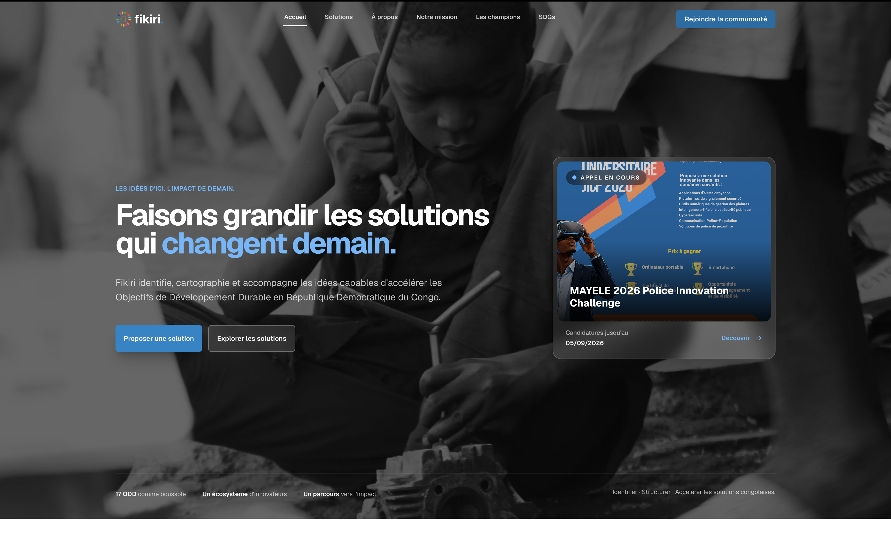
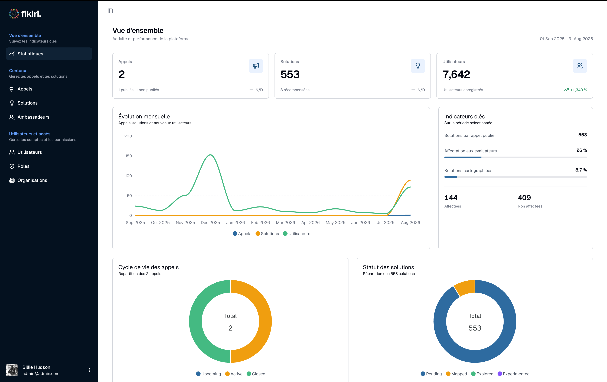

Two years after delivering Fikiri, the client called me again. He wanted a more flexible version of the platform, one that would let him manage calls, submissions, reviewers, and reviews without returning to a developer for every change.

The call meant a lot to me. V1 had done its job, and the client trusted me to take it further. I also had an advantage that no new developer would have had on the first day: I understood the product, its history, and the decisions hidden inside its code.

[Fikiri](https://fikiri.co) is a platform built for a [United Nations Development Programme](https://www.undp.org/) initiative in the Democratic Republic of the Congo. An administrator launches a call for solutions, people submit their ideas, reviewers evaluate them, and the administrator selects the winners. [Mr. Olivier Bampendi](https://www.linkedin.com/in/olimuf/), who led the innovation and digital transformation work behind the platform, asked me to return for V2.

Our relationship had continued after the first delivery through maintenance and technical advice. That continuity mattered. The client already knew how I worked, and I already knew how to translate his requests into decisions about the product. Technical ability opened the relationship, but communication and reliability sustained it.

## Meeting the developer I was two years ago

Opening the old codebase was like meeting a younger version of myself.

Some decisions made me laugh. I looked at the code and wondered, “What was I thinking?” I deleted unnecessary methods, relationships, fields, and features. V1 had been experimental and built as we went, before the shape of the product and its data was completely clear. Some of that uncertainty had naturally found its way into the implementation.

Other decisions made me proud. The application still had a structure I could navigate.

The API used NestJS, whose module-based organization made it easy to locate behavior, debug it, and add features in predictable places. The V1 frontend, however, was split between two frameworks. A colleague who later left the project had built the administration dashboard with Next.js, while I had built the user-facing application with Angular.

By the time I started V2, my understanding of Angular had grown considerably. I brought the admin, reviewer, and user experiences into one Angular application, organized each role around its own layout and feature areas, and separated data access, features, interfaces, and UI inside those areas. Designing this new architecture made me realize that I did not need an Nx monorepo to structure the application well. Clear boundaries inside a single Angular project gave me the organization I needed without adding monorepo complexity.

I had continued working with Angular and NestJS during those two years. Familiarity made me faster, but experience changed what I chose to build. I could now see which parts of V1 were sound, which constraints had become product problems, and which proposed improvements would add complexity without helping the client.

## V2 needed flexibility, not more hardcoded fields

The biggest limitation in V1 was its data model. Calls and solutions had fields hardcoded into their database entities and frontend forms. That worked while the first call was still defining what the platform needed to be, but every new variation required a code change.

V2 had to work more like Google Forms. An administrator should be able to define the form for a call, choose its fields, and collect answers without asking a developer to modify the database schema and redeploy the application.

I replaced the fixed call fields with a JSON form definition. Each field has its own identifier and metadata such as its label and type. A solution stores its answers in a JSON response object linked to those field identifiers. Labels and ordering can change without losing the relationship between a question and its answer.

The same model powers evaluation. An administrator can build a multi-phase review form, for example, an Evaluation phase followed by Curation, with different questions in each phase. Reviewers see only the phases assigned to them.

Assignment is quota-based. When adding a reviewer, the administrator specifies how many solutions that person should receive, and the system draws from solutions not yet assigned in that phase. Each solution is reviewed by one reviewer per phase, and its score is computed from that reviewer's numeric answers. This prevents duplicate assignments and makes workload distribution simple.

## I rewrote only the half that needed rewriting

V2 did not become a complete rewrite.

I rebuilt the Angular application because the UI foundation had changed. V1 used PrimeNG, but [active development was moving to the new PrimeUI licensing model](https://primeui.dev/nextchapter). Existing MIT releases would remain MIT-licensed, while future major versions would no longer be released as open source. I wanted a UI library that better matched my current workflow and the project's long-term needs, so I moved to Angular Material.

The new frontend uses Angular 22, signals for reactivity, NgRx Signal Store for feature state, and [`httpResource`](https://angular.dev/guide/http/http-resource) for reactive reads from the API. I retained the role and feature-oriented folder structure because it had already proved useful. The visual result changed substantially, but its organization still reflected what I had learned from V1.

The NestJS API was a different story. It was still a good foundation. Instead of rebuilding it, I removed unused behavior and relationships, then added the dynamic form, evaluation, assignment, and migration capabilities. Rewriting both applications would have introduced risk without giving the client equivalent value. Knowing what not to rewrite was one of the clearest differences between the developer I had been and the developer I had become.

The deployment process showed the same growth. V1 ran directly on a VPS with Caddy, Node.js, PM2, the database, and the application managed from the root account. After every push, I logged into the server, pulled the code, built it, and restarted the process manually.

For V2, I containerized the application and automated deployment with GitHub Actions. The workflow connects to the server through a dedicated user whose permissions are limited to updating and running the application, then pulls the new version and rebuilds the Docker image. A push now takes the application from the repository to production in a few seconds. The improvement was not only speed. It also reduced manual steps and removed routine application deployment from the root account.

## The risky part was moving the data

Changing a form is easy when it has no users. Fikiri already had about 7,000 accounts and 430 submitted solutions.

The difficult part was moving that information from hardcoded columns into dynamic JSON responses without losing it. I backed up the existing data, kept V1 intact while building V2, and created a separate database for the new version. Then I built a dedicated NestJS migration module with two TypeORM data sources: one connected to the old schema and one to the new schema.

The migration read each legacy record, mapped its fixed fields to the identifiers in the new form definition, and wrote the transformed record to the new database. Existing password hashes were copied unchanged, so the migration never needed users' plaintext passwords. Keeping the source database intact gave me a reference and a recovery option while I verified the result.

I first ran the migration on a sample of the data and checked the transformed records before moving the complete dataset. I then compared user and solution counts, checked names and profile relationships, compared old solution fields with their generated responses, and signed in with my own migrated account as a smoke test.

## Ten days, with a coding agent in the loop

The full deadline was ten days, but the next call for solutions had to launch after only four. I treated the work as a phased delivery. During the first four days, I built the dynamic call forms and user submission flow. I completed the reviewer and review workflows during the following six days.

We met every day during that period. Those meetings gave the client a clear view of what was ready, what remained, and which feedback needed immediate attention. The schedule worked because we kept the launch-critical scope clear, not because we pretended the entire platform could be finished in four days.

I also had a new tool available: [Codex](https://learn.chatgpt.com/docs). I used it to accelerate implementation inside a codebase whose architecture and conventions I understood. I limited its role to writing implementation code. It had no access to production data, personal information, database credentials, or password hashes.

I worked feature by feature, tested whether the output matched the expected behavior, and checked that each part was integrated with the rest of the application. I still edited areas myself when my knowledge of the code or the problem made that faster and safer.

## What shipped

The dynamic forms and submission flow were ready when the new call launched on day four. By day ten, the reviewer and review workflows were also complete. The client began giving feedback from real use, we fixed the issues that appeared, and users made the transition without major problems.

The dashboard soon showed the platform doing what it was rebuilt to do: managing new calls on top of thousands of migrated users and hundreds of solutions, without requiring another hardcoded workflow.

This project changed how I look at old code. A two-year-old codebase is not only a collection of mistakes waiting to be deleted. It records what I knew, what the client needed at the time, and which decisions still served the product. My job was not to prove that I could write everything better from scratch. It was to keep what worked, replace what constrained the product, and preserve the knowledge and data already in the system.

Two years of experience did not only help me write code faster. It helped me question old choices without dismissing them, avoid an unnecessary rewrite, improve how the application was deployed, and judge the risks of moving existing data. That judgment was earned through time and repeated work. A faster tool could support it, but it could not replace it.

The phone call was another measure of growth. The client returned because V1 worked, because I knew the platform, and because maintenance, technical advice, and honest communication had built trust beyond the initial delivery. Expertise and relationships were not competing advantages. Together, they made V2 possible.
